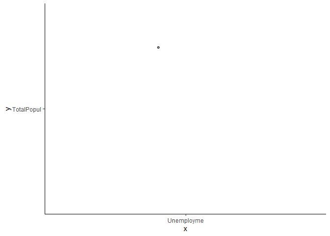
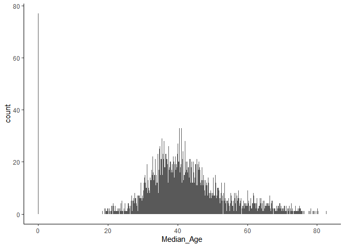
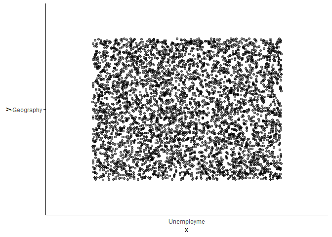

HW04
================
Elena Burkey
3/8/2021

## Unemployment Rates in Florida

``` r
if(!dir.exists(here::here("Finale_Project", "data")))
{dir.create(here::here("Finale_Project", "data", "Unemployment_Rate.csv"))}
```

``` r
Data_FL <- read_csv(here::here("Finale_Project", "data", "Unemployment_Rate.csv"))
```

    ## 
    ## -- Column specification --------------------------------------------------------
    ## cols(
    ##   .default = col_double(),
    ##   Geography = col_character()
    ## )
    ## i Use `spec()` for the full column specifications.

``` r
as_tibble(Data_FL)
```

    ## # A tibble: 4,245 x 26
    ##    OBJECTID Geography TotalPopul Unemployme Median_Hou PercentFam PercentF_1
    ##       <dbl> <chr>          <dbl>      <dbl>      <dbl>      <dbl>      <dbl>
    ##  1        1 Census T~       5959        4        61375        7.5       13.3
    ##  2        2 Census T~       3383       11.8      52429        9.1       19.1
    ##  3        3 Census T~       5091       15.2      52917       12.5       12.8
    ##  4        4 Census T~       3407       13.6      27278       28         32.1
    ##  5        5 Census T~       4734        5.5      66402        5.5       11.5
    ##  6        6 Census T~       4425        5.2      48262        6.7       15.1
    ##  7        7 Census T~       5283       14.7      29024       33.6       45.5
    ##  8        8 Census T~       4728        6.4      52500        4.3        0  
    ##  9        9 Census T~       3020        6.4      57009        5.2       13.2
    ## 10       10 Census T~       5046        7        40704       10.9       20.6
    ## # ... with 4,235 more rows, and 19 more variables: PercentPop <dbl>,
    ## #   PercentP_1 <dbl>, TotalPop_M <dbl>, PercentTot <dbl>, TotalPop_F <dbl>,
    ## #   PercentT_1 <dbl>, Median_Age <dbl>, Pop_Under5 <dbl>, PercentP_2 <dbl>,
    ## #   Pop_5to9_Y <dbl>, PercentP_3 <dbl>, Pop_10to14 <dbl>, PercentP_4 <dbl>,
    ## #   Pop_15to19 <dbl>, PercentP_5 <dbl>, Pop_18andO <dbl>, PercentP_6 <dbl>,
    ## #   Pop_65andO <dbl>, PercentP_7 <dbl>

``` r
str(Data_FL)
```

    ## tibble [4,245 x 26] (S3: spec_tbl_df/tbl_df/tbl/data.frame)
    ##  $ OBJECTID  : num [1:4245] 1 2 3 4 5 6 7 8 9 10 ...
    ##  $ Geography : chr [1:4245] "Census Tract 204.11, Broward County, Florida" "Census Tract 101.02, Broward County, Florida" "Census Tract 1104.02, Broward County, Florida" "Census Tract 103.04, Broward County, Florida" ...
    ##  $ TotalPopul: num [1:4245] 5959 3383 5091 3407 4734 ...
    ##  $ Unemployme: num [1:4245] 4 11.8 15.2 13.6 5.5 5.2 14.7 6.4 6.4 7 ...
    ##  $ Median_Hou: num [1:4245] 61375 52429 52917 27278 66402 ...
    ##  $ PercentFam: num [1:4245] 7.5 9.1 12.5 28 5.5 6.7 33.6 4.3 5.2 10.9 ...
    ##  $ PercentF_1: num [1:4245] 13.3 19.1 12.8 32.1 11.5 15.1 45.5 0 13.2 20.6 ...
    ##  $ PercentPop: num [1:4245] 17.5 19.7 23.5 37.7 21.2 19.9 41.3 24.7 16.4 23.3 ...
    ##  $ PercentP_1: num [1:4245] 12.4 15.4 8.5 20.4 14.7 17.4 21.3 28.4 35.4 14.1 ...
    ##  $ TotalPop_M: num [1:4245] 2455 1739 2428 1692 2212 ...
    ##  $ PercentTot: num [1:4245] 41.2 51.4 47.7 49.7 46.7 44.1 49.3 53.8 48.3 48.5 ...
    ##  $ TotalPop_F: num [1:4245] 3504 1644 2663 1715 2522 ...
    ##  $ PercentT_1: num [1:4245] 58.8 48.6 52.3 50.3 53.3 55.9 50.7 46.2 51.7 51.5 ...
    ##  $ Median_Age: num [1:4245] 47.5 47.2 36 37.1 39.8 49.7 30.5 38.6 52 48.9 ...
    ##  $ Pop_Under5: num [1:4245] 220 166 273 219 293 177 295 226 169 243 ...
    ##  $ PercentP_2: num [1:4245] 3.7 4.9 5.4 6.4 6.2 4 5.6 4.8 5.6 4.8 ...
    ##  $ Pop_5to9_Y: num [1:4245] 285 148 353 307 240 164 365 96 49 395 ...
    ##  $ PercentP_3: num [1:4245] 4.8 4.4 6.9 9 5.1 3.7 6.9 2 1.6 7.8 ...
    ##  $ Pop_10to14: num [1:4245] 239 145 273 207 327 253 319 167 42 150 ...
    ##  $ PercentP_4: num [1:4245] 4 4.3 5.4 6.1 6.9 5.7 6 3.5 1.4 3 ...
    ##  $ Pop_15to19: num [1:4245] 298 170 384 232 285 197 442 181 28 117 ...
    ##  $ PercentP_5: num [1:4245] 5 5 7.5 6.8 6 4.5 8.4 3.8 0.9 2.3 ...
    ##  $ Pop_18andO: num [1:4245] 4985 2780 3952 2493 3707 ...
    ##  $ PercentP_6: num [1:4245] 83.7 82.2 77.6 73.2 78.3 82.9 76.4 86.2 90.9 82.6 ...
    ##  $ Pop_65andO: num [1:4245] 1504 469 663 412 568 ...
    ##  $ PercentP_7: num [1:4245] 25.2 13.9 13 12.1 12 27.6 10.4 14.5 28.7 33 ...
    ##  - attr(*, "spec")=
    ##   .. cols(
    ##   ..   OBJECTID = col_double(),
    ##   ..   Geography = col_character(),
    ##   ..   TotalPopul = col_double(),
    ##   ..   Unemployme = col_double(),
    ##   ..   Median_Hou = col_double(),
    ##   ..   PercentFam = col_double(),
    ##   ..   PercentF_1 = col_double(),
    ##   ..   PercentPop = col_double(),
    ##   ..   PercentP_1 = col_double(),
    ##   ..   TotalPop_M = col_double(),
    ##   ..   PercentTot = col_double(),
    ##   ..   TotalPop_F = col_double(),
    ##   ..   PercentT_1 = col_double(),
    ##   ..   Median_Age = col_double(),
    ##   ..   Pop_Under5 = col_double(),
    ##   ..   PercentP_2 = col_double(),
    ##   ..   Pop_5to9_Y = col_double(),
    ##   ..   PercentP_3 = col_double(),
    ##   ..   Pop_10to14 = col_double(),
    ##   ..   PercentP_4 = col_double(),
    ##   ..   Pop_15to19 = col_double(),
    ##   ..   PercentP_5 = col_double(),
    ##   ..   Pop_18andO = col_double(),
    ##   ..   PercentP_6 = col_double(),
    ##   ..   Pop_65andO = col_double(),
    ##   ..   PercentP_7 = col_double()
    ##   .. )

``` r
Summary <- Data_FL %>%
  summarize(across(c(TotalPopul : PercentP_7),
                   list( mu = ~ mean (.x, na.rm = TRUE),
                         sd = ~ sd (.x, na.rm = TRUE),
                         min = ~ min (.x, na.rm = TRUE),
                         max = ~ max (.x, na.rm = TRUE))))
```

``` r
Plot1 <- Summary %>%
ggplot() +
  aes(y = "TotalPopul", x = "Unemployme") +
  geom_jitter(alpha = .5) +
  theme_classic() 
Plot1
```

<!-- -->

``` r
ggplot(Data_FL, aes(Median_Age)) +
  geom_bar() +
  theme_classic() 
```

<!-- -->

``` r
ggplot(Data_FL) +
  aes(y = "Geography", x = "Unemployme") +
  geom_jitter(alpha = .5) +
  theme_classic() 
```

<!-- -->
